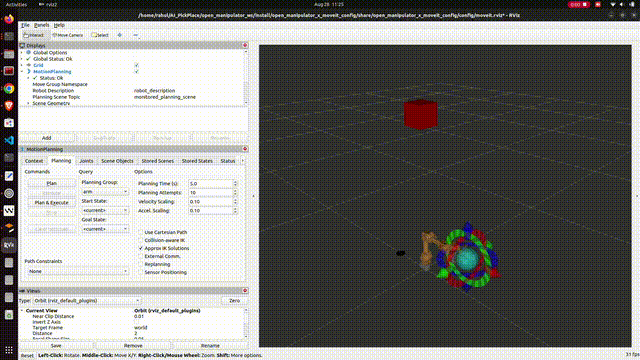
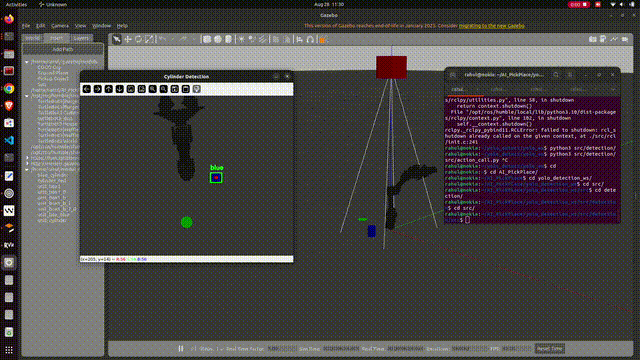

---

# 🤖 AI Pick & Place with YOLO + OpenManipulator-X

This project integrates **YOLO-based object detection** with the **OpenManipulator-X** robotic arm in Gazebo + MoveIt2 to perform **autonomous pick and place** of colored cylinders.

It was developed as part of my **AI Robotics Integration assignment**.

---

## 📹 Demo

### MoveIt + Planning Scene



### Autonomous Pick & Place



---

## 📂 Repository Structure

```
AI_PickPlace/
│── open_manipulator_ws/        # OpenManipulator-X workspace
│   ├── src/open_manipulator_x_bringup
│   ├── src/open_manipulator_x_moveit_config
│   ├── src/open_manipulator_x_description
│   └── src/open_manipulator_x_teleop
│
│── yolo_detection_ws/          # YOLO Detection + Integration workspace
│   ├── src/detection/
│   │   ├── detection.py        # Color/YOLO detection & pose publishing
│   │   ├── action_call.py      # Pick & Place sequence node
│   │   ├── yolov8n.pt          # YOLO model
│   │   ├── yolo11n.pt
│   │   ├── config/             # Camera config
│   │   └── launch/             # Simulation + RSP launch files
│
│── moveit_demo.gif             # Demo GIF of MoveIt planning
│── pick_place.gif              # Demo GIF of pick and place
│── README.md
```

---

## 🚀 Installation & Setup

### 1. Clone the repository

```bash
git clone https://github.com/rahulrajak6942/AI_PickPlace.git
cd AI_PickPlace
```

### 2. Build workspaces

#### OpenManipulator

```bash
cd open_manipulator_ws
colcon build --symlink-install
source install/setup.bash
```

#### YOLO Detection

```bash
cd yolo_detection_ws
colcon build --symlink-install
source install/setup.bash
```

---

## ▶️ Running the Simulation

### 1. Launch Gazebo with the robot

```bash
ros2 launch open_manipulator_x_bringup gazebo.launch.py
```

### 2. Launch MoveIt for planning

```bash
ros2 launch open_manipulator_x_moveit_config moveit_core.launch.py
```

### 3. Teleoperation (optional)

```bash
ros2 run open_manipulator_x_teleop simple_teleop_node
```

### 4. Run detection node (color/YOLO-based)

```bash
cd yolo_detection_ws
source install/setup.bash
python3 src/detection/src/detection.py
```

### 5. Run pick & place action node

```bash
cd yolo_detection_ws
source install/setup.bash
python3 src/detection/src/action_call.py
```

---

## 🛠️ Workflow (4-Step Pick & Place)

1. **Detect object** (YOLO/color-based detection publishes pose → `/detected_target_pose`)
2. **Open gripper**
3. **Move to detected pose**
4. **Move down by 7.5cm & close gripper**

---

## 📌 Notes

* Cylinder size used in simulation: **2 cm diameter**
* Gripper open/close positions tuned for object size:

  * `0.01` → open
  * `-0.005 to -0.01` → close (adjust depending on object width to avoid “flying away”)

---

## 📧 Author

👤 **Rahul Rajak**
GitHub: [rahulrajak6942](https://github.com/rahulrajak6942)


